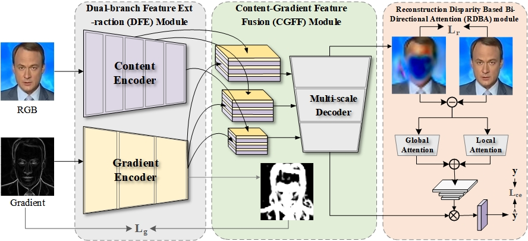

# Multi-scale-Reconstruction-Features

## RLGC: Reconstruction-Guided Gradient Consistency Network for Deepfake Face Detection

Repo of the Reconstruction Learning Fusing Gradient and Content Features for Efficient Deepfake Detection

## 🏗️ Method Overview


The overall framework of our proposed method.

<p align="center">
  
</p>

## 🔧 Installation

### 1. Clone repository

```bash
git clone https://github.com/YourUsername/RLGC.git
cd RLGC
```

### 2. Create environment

```bash
conda create -n rlgc python=3.8
conda activate rlgc

# Install PyTorch (CUDA 11.6)
pip install torch==1.13.0+cu116 torchvision==0.14.0+cu116 \
  --index-url https://download.pytorch.org/whl/cu116

# Install other dependencies
pip install -r requirements.txt
```

### 3. Dependencies

The following packages are required:

- `torch >= 1.13.0`
- `torchvision >= 0.14.0`
- `opencv-python`
- `numpy`
- `matplotlib`
- `scikit-image`
- `pillow`

## 📦 Pretrained Models

We provide pretrained models for evaluation and reproduction.

| Model | Description | Link |
|-------|------------|------|
| `RLGC.pth` | Full DGNet model trained for deepfake detection | 🔗 [Google Drive]() |
| `RetinaFace-Resnet50-fixed.pth` | Face detection backbone for preprocessing | 🔗 [Google Drive]() |

After downloading, please place the model weights as follows:

```
RLGC
├── model_weight
│   └── RLGC.pth
└── faceUtil
    └── pre_model_weight
        └── RetinaFace-Resnet50-fixed.pth
```

## 🎬 Test Samples

We provide several test images for quick evaluation.

## 🚀 Usage

### Quick Test

Run the inference script on a single image:

```bash
cd RLGC测试代码
python RLGC_test.py
```

To test on your own images, modify the `imgpath` variable in `RLGC_test.py`:

```python
imgpath = '/path/to/your/image.jpg'
```

### Programmatic Usage

```python
import torch
import cv2
import numpy as np
from torchvision import transforms
from faceUtil.face_utils import FaceDetector, norm_crop
from model.DGNetFF import DGNet

# Load face detector
face_detector = FaceDetector()
face_detector.load_checkpoint("faceUtil/pre_model_weight/RetinaFace-Resnet50-fixed.pth")

# Load RLGC model
model = DGNet(channel=64, arc='EfficientNet-B4', M=[8, 8, 8], N=[4, 8, 16]).cuda()
model.load_state_dict(torch.load('model_weight/RLGC.pth'))
model.eval()

# Preprocess image
img = cv2.imread('your_image.jpg')
boxes, landms = face_detector.detect(img)
landmarks = landms[0].detach().numpy().reshape(5, 2).astype(int)
face = norm_crop(img, landmarks, image_size=320)

# Transform
transform = transforms.Compose([
    transforms.ToPILImage(),
    transforms.ToTensor(),
])
input_tensor = transform(face).float().unsqueeze(0).cuda()

# Compute gradient image
img_gray = cv2.cvtColor(face, cv2.COLOR_RGB2GRAY)
gradient_x = cv2.Sobel(img_gray, cv2.CV_64F, 1, 0, ksize=3)
gradient_y = cv2.Sobel(img_gray, cv2.CV_64F, 0, 1, ksize=3)
gradient_image = np.sqrt(gradient_x ** 2 + gradient_y ** 2)
gradient_image = torch.from_numpy(gradient_image).unsqueeze(0).cuda()

# Inference
with torch.no_grad():
    logits, recons_x, pg = model(input_tensor, gradient_image)
    pred = torch.argmax(logits.squeeze(), dim=-1).item()

print(f"Prediction: {'Real' if pred == 1 else 'Fake'}")
```

## 📂 Project Structure

```
RLGC
├── README.md
├── requirements.txt
├── RLGC测试图片/                  # Test sample images
│   ├── fake/                      # Fake (generated) face images
│   └── real/                      # Real face images
├── RLGC测试代码/                  # Main code directory
│   ├── RLGC_test.py               # Entry point for inference
│   ├── model/                     # DGNet model implementation
│   │   ├── DGNetFF.py             # Core DGNet architecture
│   │   ├── EfficientNet.py        # EfficientNet backbone
│   │   └── utils.py               # Model utilities
│   ├── model_weight/              # Pretrained weights directory
│   │   └── RLGC.pth               # DGNet pretrained weights
│   └── faceUtil/                  # Face detection utilities
│       ├── face_utils.py          # Face detector wrapper
│       ├── data/                  # Config and data processing
│       ├── layers/                # PriorBox and loss functions
│       ├── models/                # RetinaFace model
│       ├── utils/                 # Box operations and NMS
│       └── pre_model_weight/      # Face detection weights
│           └── RetinaFace-Resnet50-fixed.pth
```

## 📝 Citation

If you find this project useful, please consider citing our paper:

```bibtex
@ARTICLE{10612835,
  author={Xu, Kaiwen and Hu, Xiyuan and Zhou, Xiaokang and Xu, Xiaolong and Qi, Lianyong and Chen, Chen},
  journal={IEEE Transactions on Consumer Electronics}, 
  title={RLGC: Reconstruction Learning Fusing Gradient and Content Features for Efficient Deepfake Detection}, 
  year={2024},
  volume={70},
  number={3},
  pages={6084-6094},
  keywords={Image reconstruction;Feature extraction;Forgery;Faces;Face recognition;Deepfakes;Generative adversarial networks;Deepfake detection;deep generative model;multi-scale feature fusion;reconstruction learning},
  doi={10.1109/TCE.2024.3435032}}
```
